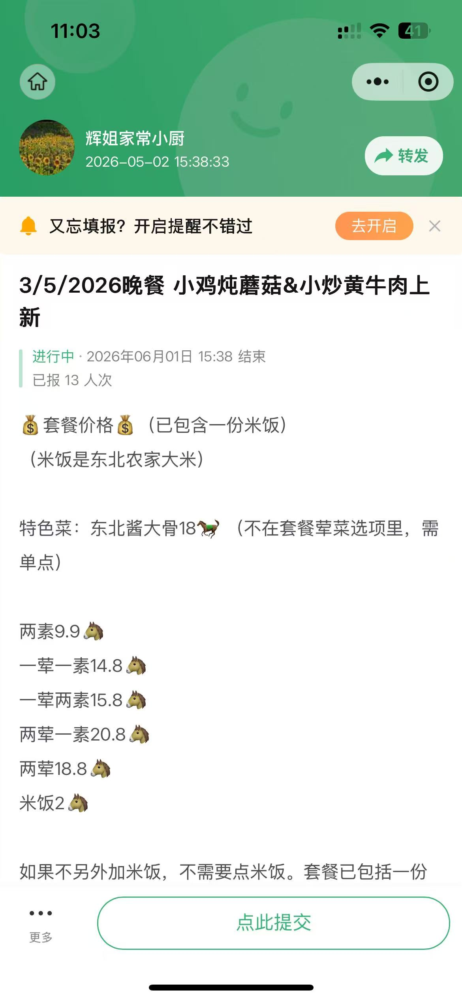
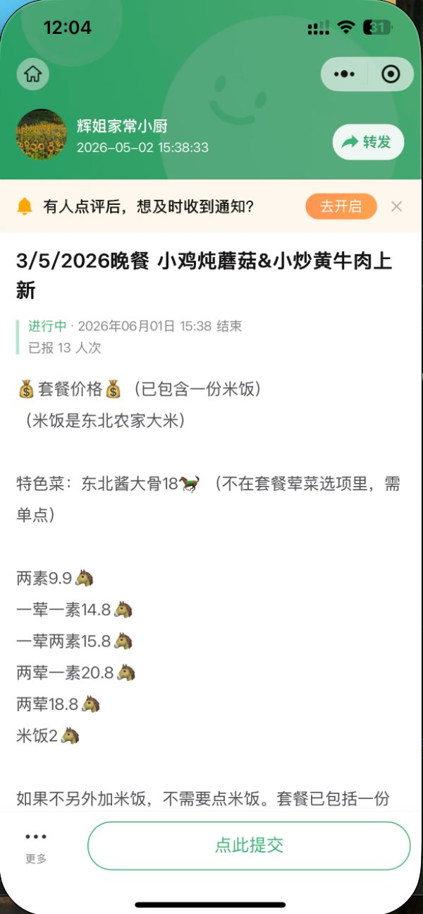

# 03 - 顾客端功能

> 顾客端是核心体验。请优先做这一部分，做精做细。

## 整体页面结构

顾客访问的 URL 格式：`yourapp.com/shop/[shop-slug]/[project-id]`

例如：`yourapp.com/shop/huijie/5may2026-dinner`

```
┌─ 抬头区 ────────────────┐
│ 店名（必填）             │
│ 门头图片（选填，Banner） │
│ 状态条 + 三格信息       │
├─ 内容区 ────────────────┤
│ 区块一：文字区          │
│ 区块二：图片区          │
├─ 商品清单 ──────────────┤
│ 每件商品的卡片          │
├─ 底部固定栏 ────────────┤
│ [我的订单] [点此提交]    │
│ 底部小字注册入口         │
└─────────────────────────┘
```

**参考截图（顾客端首页）：**



---

## 3.1 抬头区

### 3.1.1 店名（必填）

- 始终显示在最顶部
- 不管有没有门头图片，店名必须可见
- 字号大、颜色深、易读

### 3.1.2 门头图片（选填）

- 商户在店铺设置中上传
- 有图片：作为 Banner 显示在店名上方
- 没图片：显示主题色纯色背景 + 店名居中

### 3.1.3 三格信息栏

横向三个等宽格子：

```
┌──────────┬──────────┬──────────┐
│ 截止时间  │ 已报人数  │ 配送方式  │
│ 18:00    │  13 单   │  自取/送 │
└──────────┴──────────┴──────────┘
```

### 3.1.4 状态条

颜色和文字根据状态变化（实时同步）：

| 状态 | 颜色 | 文字 |
|---|---|---|
| 报名中 | 🟢 绿色 | "报名中 · 还剩 X 时 X 分截止" |
| 已截止 | ⚪ 灰色 | "已截止" |
| 已满员 | 🟡 黄色 | "已满员" |

---

## 3.2 内容区（两个区块）

商户在编辑菜单时填写，所有字段都可不填。

### 3.2.1 区块一：文字区

- 纯文字，商户自由输入
- 用于套餐说明、价格列表、备注、规则等
- 支持换行，保留输入格式
- 可不填

### 3.2.2 区块二：图片区

- 商户上传图片，每张图片下方有**选填**的文字说明框
- 商户可以为每张图片配简短说明（如"小鸡炖蘑菇 RM14.8"）
- 不配文字 → 只显示图片
- 配了文字 → 图片下方显示文字
- 支持多张图片，自动排版
- **第一张图片默认作为分享卡片封面**

### 3.2.3 排版规则

```
1 张图片：全宽展示
2 张图片：左右并排
3 张图片：1 大 + 2 小
4+ 张图片：网格布局，可滑动查看
```

---

## 3.3 商品清单

### 3.3.1 商品卡片字段

按显示顺序：

| 字段 | 是否必填 | 说明 |
|---|---|---|
| 商品名称 | ✅ 必填 | 主标题 |
| 备注（一行说明）| 选填 | 淡色小字，名称下方 |
| 价格 | ✅ 必填 | 显眼显示 |
| 活动价 | 选填 | 见下文活动价规则 |
| 库存 | ✅ 必填 | 余量提示 |
| 图片 | 选填 | 没有就不显示 |
| 加减按钮 | - | 顾客操作 |

### 3.3.2 布局规则

**有图片时：**
```
┌────┐  晚餐套餐 1 荤 1 素                        [+]
│ 图 │  含一份米饭，可选两素
└────┘  RM 14.8        余量 48
```

**没图片时（文字左移占满）：**
```
晚餐套餐 1 荤 1 素                              [+]
含一份米饭，可选两素
RM 14.8        余量 48
```

不留空白占位，整体更紧凑。

### 3.3.3 活动价（早鸟优惠）

商品可选设置"活动价"，效果：

**字段：**
- 原价（必填，比如 RM 14.8）
- 活动价（选填，比如 RM 10.8）
- 活动起止时间（选填）

**显示逻辑（前端按当前时间判断）：**

```
活动期内显示：
┌────┐  晚餐套餐 1 荤 1 素              🐦 早鸟价
│ 图 │  含一份米饭
└────┘  ~~RM 14.8~~  RM 10.8     余量 48
        ⏰ 还剩 1 小时 23 分

活动结束后自动恢复：
┌────┐  晚餐套餐 1 荤 1 素                        [+]
│ 图 │  含一份米饭
└────┘  RM 14.8         余量 48
```

**实现方式：** 前端按当前时间判断，无需后端定时任务。

### 3.3.4 商品上下架

- 每件商品有"上架/下架"开关，默认上架
- 下架的商品顾客看不到
- 商户可一键下架（不删除，可随时恢复）
- 已下单的订单不受商品下架影响

### 3.3.5 库存超卖处理

- **不允许超卖**
- 库存为 0 时，[+] 按钮变灰，无法选择
- 顾客提交订单时，再次校验库存
  - 库存够 → 创建订单，扣减库存
  - 库存不足 → 提示"已售罄，请重新选择"

---

## 3.4 底部固定栏

```
┌───────────────────────────────────────┐
│  [📋 我的订单]    [🛒 点此提交]         │
└───────────────────────────────────────┘
```

### 3.4.1 [我的订单]

- 始终显示
- 顾客没下过单：点击显示"还没有订单，先下一单吧"
- 顾客有订单：点击进入"我的订单"列表页

### 3.4.2 [点此提交]

- 主操作按钮
- 顾客没选商品：变灰，提示"请先选择商品"
- 顾客选了商品：显示已选件数和总价
- 状态为"已截止"或"已满员"时变灰，文字改为"已截止"

### 3.4.3 注册入口（底部小字）

```
─────────────────────────────────
   想拥有自己的店？立即免费创建 →
─────────────────────────────────
```

不打扰顾客，但有兴趣的能看到。

---

## 3.5 下单流程

### 步骤 1：选菜

顾客在商品清单选择商品和数量，底部实时显示已选件数和总价。

### 步骤 2：填写信息

```
┌─────────────────────────────────────┐
│ 填写信息                              │
├─────────────────────────────────────┤
│ 姓名 *  [_____________]              │
│ 电话 *  [_____________]              │
│ 地址 *  [_____________]              │
│ 备注    [_____________]              │
└─────────────────────────────────────┘
```

- 姓名、电话、地址必填
- 电话可作为弱身份标识（同手机号可关联订单历史）
- 备注选填

### 步骤 3：选择配送点

商户为本次项目启用了几个配送点，列表显示给顾客：

```
请选择配送点：
○ 配送点 1 · A 座大堂
○ 配送点 2 · B 座入口
○ 配送点 3 · 自取
○ 以上都不对（其他）  ← 固定选项

[查看详情]（点击展开看配送时间、地点图片等）
```

**注意：** 第一版顾客手动选，第二版才做关键词自动匹配。

如果顾客选"以上都不对（其他）"：
- 系统自动带入顾客填写的地址
- 该订单进入管理员"手动匹配配送点"队列

### 步骤 4：提交

```
点击"提交"
   ↓
系统校验库存
   ↓
├─ 库存够 → 创建订单，分配编号（按提交时间顺序，固定不变）
└─ 库存不足 → 提示重新选择

成功后显示"提交成功"页：
✓ 订单提交成功
你的编号：#L8

[查看订单详情] [上传付款截图]
```

---

## 3.6 我的订单页

### 3.6.1 入口

- 底部固定按钮 [我的订单]
- 提交订单后的"提交成功"页

### 3.6.2 订单列表

一个顾客可以有**多个独立订单**（重要规则）：

```
我的订单（共 2 单）
─────────────────────────────────
📋 订单 #L5  10:35  待补付款
   1荤1素 ×1 + 可乐 ×1 + 米饭 ×1
   已付 RM 14.8 / 总计 RM 18.8
   [查看详情]
─────────────────────────────────
📋 订单 #L8  10:50  待核实
   1荤1素 ×2
   总计 RM 29.6
   [查看详情]
─────────────────────────────────
[+ 下新订单]
```

### 3.6.3 订单详情页

```
┌─────────────────────────────────┐
│ 订单 #L8                        │
│ [大字编号 + 取餐二维码]          │
├─────────────────────────────────┤
│ 项目：3/5/2026 晚餐             │
│ 下单时间：05-02 10:50           │
│ 配送点：配送点 2 · B 座入口      │
│ 状态：⏳ 待核实                 │
├─────────────────────────────────┤
│ 已选商品                         │
│ 1荤1素 ×2          RM 29.6     │
│ ─────────                        │
│ 总计 RM 29.6                    │
├─────────────────────────────────┤
│ 顾客信息                         │
│ 姓名：李美玲                    │
│ 电话：6012-3456789              │
│ 地址：B1-25-12, CASA Residenzi │
│ 备注：（无）                    │
│ [✏️ 修改信息]                   │
├─────────────────────────────────┤
│ 付款截图                         │
│ 🧾 截图 1  10:52                │
│ [缩略图]                         │
│ [+ 追加截图]  [删除截图]         │
├─────────────────────────────────┤
│ 订单操作                         │
│ [+ 加菜]                        │
│ [取消订单]                      │
└─────────────────────────────────┘
```

### 3.6.4 订单状态

| 状态 | 含义 | 颜色标记 |
|---|---|---|
| 待付款 | 顾客已提交，未上传截图 | 🔴 红 |
| 待核实 | 已上传截图，等商户确认 | 🟡 黄 |
| 已确认付款 | 商户已确认收款 | 🟢 绿 |
| 待补付款 | 加菜后金额变更，需补付 | 🟠 橙 |
| 已取消 | 顾客取消或商户拒绝 | ⚪ 灰 |

### 3.6.5 修改订单的边界规则

| 状态 | 加菜 | 改备注/地址 | 取消 |
|---|:---:|:---:|:---:|
| 待付款 | ✅ | ✅ | ✅ |
| 待核实 | ✅ | ✅ | ✅ |
| 已确认付款 | ✅（变待补付款）| ✅（需商户同意）| ❌ 需联系商户 |
| 已截单 | ❌ | ❌ | ❌ |

**重要规则：**
- **只能加菜，不能减菜**（避免退款麻烦）
- 想减菜 → 取消整单重下
- 加菜后订单自动变"待补付款"，顾客补付差额并追加截图

### 3.6.6 加菜补付的流程

```
1. 顾客在已确认订单点 [+ 加菜]
2. 跳转选菜页面，原已选商品保留，可继续添加
3. 提交后：
   ├─ 计算差额
   ├─ 订单状态变"待补付款"
   └─ 显示提示："请补付 RM 4.0 并上传新截图"
4. 顾客上传新截图 → 状态变"待核实"
5. 商户确认 → 状态变"已确认付款"
```

订单详情中清楚显示分笔记录：

```
【原订单】RM 14.8  ✓ 已付款
1荤1素 ×1

【追加】RM 4.0  ⚠ 待付款
可乐 ×1
米饭 ×1

订单总计：RM 18.8
已付：RM 14.8
待付：RM 4.0

付款截图：
🧾 截图 1  10:35  RM 14.8  ✓ 已确认
🧾 截图 2  11:02  RM 4.0   待核实
```

---

## 3.7 付款截图功能

### 3.7.1 上传

- 顾客提交订单后引导上传付款截图
- 支持从相册选择、拍照
- 上传后立即显示缩略图
- 每张截图记录上传时间

### 3.7.2 多张截图

- 加菜补付场景需要追加截图
- 一个订单可有多张截图
- 每张截图独立显示状态（待核实/已确认）

### 3.7.3 删除截图

- 顾客可删除自己上传的截图
- **必须二次确认**（防误删）
- 已确认的截图删除后状态退回"待核实"

### 3.7.4 隐私

- 付款截图**仅商户和管理员可见**
- 其他顾客看不到任何人的截图
- 上传时给顾客提示："你的付款截图仅商户可见"

### 3.7.5 系统自动检查（辅助）

上传时系统在后台执行两项检查：

| 检查 | 触发条件 | 结果 |
|---|---|---|
| 上传时间检查 | 截图上传时间早于下单时间 | 标黄警告 |
| MD5 比对 | 与该商户历史截图 MD5 重复 | 标红警告 |

**这些只是辅助提示，最终由商户人工判断。**

---

## 3.8 意见反馈入口

### 3.8.1 触发时机

- 订单提交成功后顺手询问："觉得好用吗？有什么想法？"
- "更多"菜单中常驻入口

### 3.8.2 反馈表单

```
┌─────────────────────────────────┐
│ 意见反馈                         │
├─────────────────────────────────┤
│ 反馈类型：                       │
│ ○ 发现 Bug                       │
│ ○ 功能建议                      │
│ ○ 使用体验                      │
│ ○ 其他                          │
│                                 │
│ 详细描述：                       │
│ [_______________________]       │
│                                 │
│ 联系方式（选填）：               │
│ [_______________________]       │
│                                 │
│      [提交反馈]                  │
└─────────────────────────────────┘
```

### 3.8.3 提交后

- 显示"感谢反馈，我们会认真看每一条"
- 反馈进入平台后台供平台方查看（第二版功能）

---

## 3.9 "更多"菜单

参考截图：



> 注意：截图是群报数的，我们要做的菜单内容跟它不一样，参考布局风格即可。

**普通顾客 / 已注册顾客的"更多"菜单内容：**

```
┌─────────────────────────────┐
│ 🏠 商户首页                  │
│ 📋 我的订单                  │
│ 🔗 复制链接                  │
│ 💬 意见反馈                  │
├─────────────────────────────┤
│ ✨ 想拥有自己的店？立即创建 → │
└─────────────────────────────┘
```

**管理员/创建人 看到的会增加管理入口** —— 见 `02-用户角色与权限.md`

---

## 3.10 不允许做的事

❌ **不要做这些（已被否决）：**

1. **不要做取餐二维码功能** — 订单编号叫号就够，二维码核销是过度设计
2. **不要在顾客端塞任何第三方广告** — 这是核心承诺
3. **不要做评分、点赞、评论** — 订餐场景用不上
4. **不要强制顾客注册** — 游客可下单是核心
5. **不要做"用户留言"等社交字段** — 简化界面
