# 04 - 商户后台功能

> 商户后台是 H5 + PWA，支持添加到桌面、推送通知。
> URL: `yourapp.com/dashboard/[shop-slug]`

---

## 4.1 商户后台首页（Dashboard）

商户登录后看到的第一个页面，给出当天经营状况的快速概览。

### 4.1.1 布局

```
┌─────────────────────────────────────┐
│ 早上好，辉姐 👋                      │
├─────────────────────────────────────┤
│ 今日数据（如果有进行中的项目）        │
│ ┌───────┬───────┬───────┐          │
│ │已确认  │待确认  │待付款  │          │
│ │RM 215 │RM 38  │RM 19  │          │
│ │11 单  │ 2 单  │ 1 单  │          │
│ └───────┴───────┴───────┘          │
├─────────────────────────────────────┤
│ 今日项目                              │
│ ─ 5/4 晚餐（进行中）                 │
│   截止：18:00                       │
│   [查看订单] [生成分享卡]             │
├─────────────────────────────────────┤
│ 快捷操作                              │
│ [+ 复制昨日菜单创建新项目]            │
│ [+ 创建新项目（空白）]                │
├─────────────────────────────────────┤
│ 历史项目（最近 5 个）                 │
│ ─ 5/3 晚餐    23 单   RM 422        │
│ ─ 5/2 午餐    18 单   RM 312        │
│ ─ 查看全部 →                        │
└─────────────────────────────────────┘
```

### 4.1.2 三色卡片说明

按状态分组显示金额和单数：
- 🟢 已确认到账（核心指标，最显眼）
- 🟡 待确认（需要商户处理）
- 🔴 待付款（提醒商户跟进）

### 4.1.3 多店铺切换

如果用户有多个店铺，顶部有店铺切换器：

```
[辉姐家常小厨 ▾]
  ├── 辉姐家常小厨（当前）
  ├── 辉姐烘焙坊
  └── + 创建新店铺
```

---

## 4.2 项目列表

### 4.2.1 文件夹分组

```
我的项目
├── 📝 草稿箱（系统默认）
├── ✅ 已发布（系统默认）
├── 🏁 已截止（系统默认）
└── 第二版功能：自定义文件夹
```

**自动归类：** 项目根据状态自动落入对应文件夹。

**草稿箱内容：**
- 新建未填完
- 新建已填完未发布
- 从历史项目复制（含来源信息）
- 从他人模板复制
- 编辑中的草稿

### 4.2.2 列表显示

```
已发布
─────────────────────────
📋 5/4 晚餐
   截止：18:00（还剩 3h）
   13 单 · RM 215.4 已到账
   [查看订单] [⋯ 更多]

📋 5/4 午餐（已截止）
   截止时间：13:00
   8 单 · RM 134.4 已到账
   [查看订单] [⋯ 更多]
```

### 4.2.3 项目操作菜单（[⋯ 更多]）

```
✏️ 编辑（仅高级管理员/创建人）
📋 复制创建（基于此项目创建新项目）
🔗 生成分享卡片
📊 数据统计
⏹️ 手动截单 / 重新开放
🗑️ 删除项目（仅创建人）
```

---

## 4.3 编辑项目（核心页面）

参考截图（群报数的编辑页面，我们要做类似但更精简）：

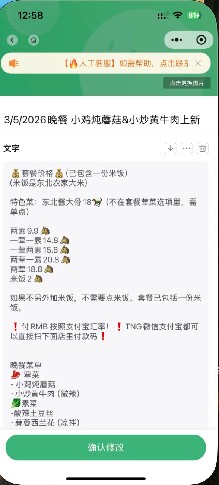
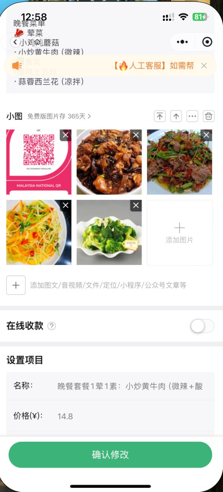
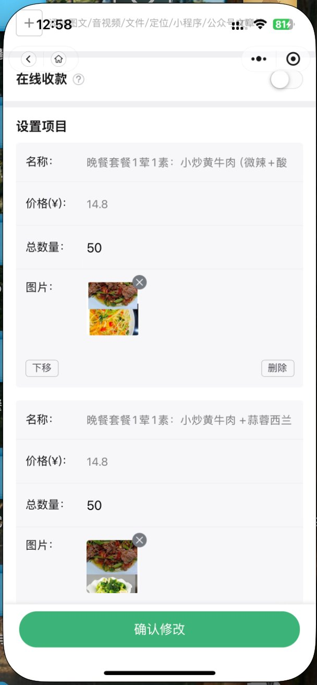
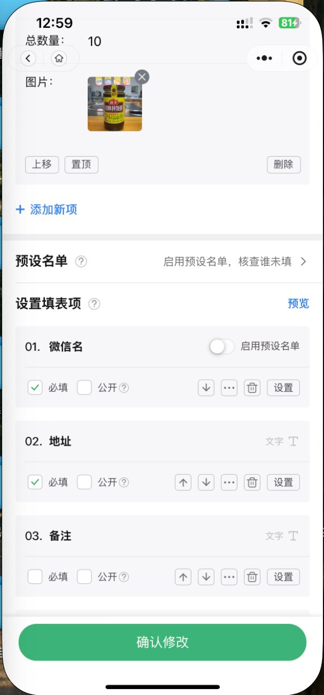
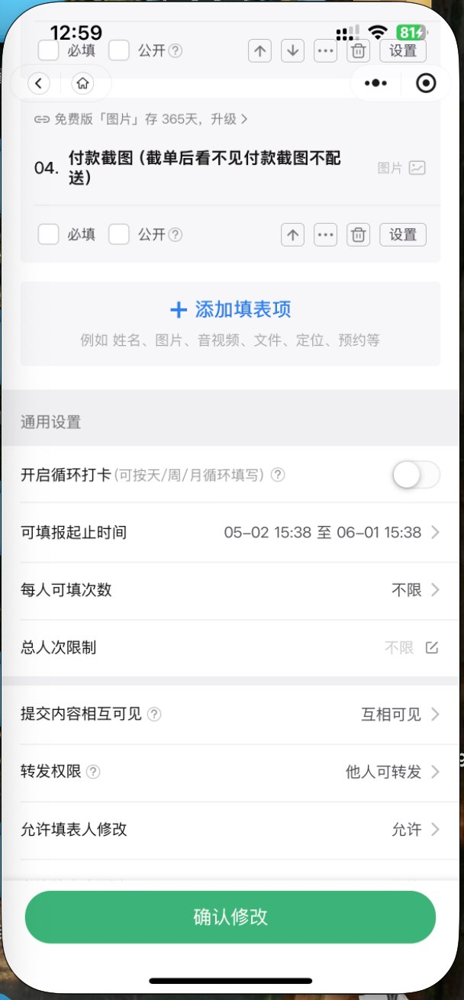

### 4.3.1 页面结构

```
编辑项目
─────────────────────────────────────────
【基础信息】
项目标题：[3/5/2026 晚餐_______________]
截止时间：[2026-06-01 18:00]
人数上限：[不限] / [_____]

【内容区】
区块一：文字区
[文字编辑器，多行输入]

区块二：图片区
[+ 添加图片]
[图片1] 文字说明: [_______]
[图片2] 文字说明: [_______]
（每张图选填文字说明，第一张作分享卡封面）

【商品清单】
[+ 添加商品]
─────
商品 1：晚餐套餐 1 荤 1 素
  名称：[_______]
  备注（一行说明，淡色字）：[_______]
  价格：[14.8]
  活动价：[10.8]（选填）
  活动起止：[___] 至 [___]（选填）
  库存：[50]
  图片：[+ 上传]
  上架状态：[●开] / [○关]
  [↑ 上移] [↓ 下移] [🗑 删除]

【配送点（从配送点库勾选）】
☑ 配送点 1 · A 座大堂
☑ 配送点 2 · B 座入口
☐ 配送点 3 · 自取
[全选] [取消全选]
[+ 新增配送点]

【顾客填写信息】
☑ 姓名（必填）
☑ 电话（必填）
☑ 地址（必填）
☑ 备注（选填）

【订单设置】
每人可下单次数：[不限 ▾]
顾客订单可见性：[仅自己可见 ▾]
允许顾客修改订单：[允许 ▾]
允许顾客取消订单：[允许（待付款前）▾]

【保存】
[💾 保存草稿]   [✓ 发布]
```

### 4.3.2 关键设置项详解

**每人可下单次数：**
- 默认"不限"
- 可设"每人最多 1 次"
- 可设"每人最多 N 次"

**顾客订单可见性：**

| 模式 | 说明 |
|---|---|
| 互相可见 | 所有顾客可看其他人的订单（可造氛围）|
| 仅自己可见 | 顾客只能看到自己的订单（默认）|
| 仅商户可见 | 顾客什么都看不到，只有商户能看 |

**允许顾客修改/取消订单：**
- 默认允许
- 商户可关闭（适用于不希望顾客修改的场景）

### 4.3.3 项目复制

点击"复制创建"：

```
复制项目：5/3 晚餐 → 创建新项目
─────────────────────────────────────
是否一并复制管理员？
○ 是
● 否（推荐）

[确认复制]
```

**复制规则：**
- 默认复制：店名、Logo、主题色、文字区、图片区、商品、配送点、填写项设置
- 询问：管理员
- 不复制：订单数据、历史截图
- 复制后：状态为"草稿"，进入草稿箱
- 商户可任意修改新项目的所有字段

### 4.3.4 草稿保存

- "保存草稿"按钮独立显示
- 进入"草稿箱"
- 显示来源信息（如"复制自 5/3 晚餐"）
- 永久保留（第一版不自动清理）

### 4.3.5 发布

- 草稿状态 → 已发布
- 发布后弹出"创建成功"页面：

```
✓ 创建成功，快分享吧！

[📤 生成分享卡片]
[🔗 复制链接]
[📐 生成二维码]

您还可：
[+ 添加管理员]
[💾 保存为模板]
```

---

## 4.4 商品管理细节

### 4.4.1 字段定义

| 字段 | 必填 | 说明 |
|---|---|---|
| 商品名称 | ✅ | 主标题 |
| 备注 | 选填 | 一行短说明（如"含米饭"、"微辣"）|
| 价格 | ✅ | 原价 |
| 活动价 | 选填 | 早鸟/促销价 |
| 活动起止 | 选填 | 活动有效时间 |
| 库存 | ✅ | 数量 |
| 图片 | 选填 | 没有就不显示图片区 |
| 上架状态 | ✅ | 默认上架 |

### 4.4.2 顾客已下单的商品如何修改？

**规则：**
- 已被下单的商品**不能修改基本信息**（名称、价格）
- **可以**：
  - 把库存改为 0（让其他人无法继续下单）
  - 下架（顾客看不到，但已下单的不受影响）
  - 商户创建新商品代替

这样既保护已下单顾客，又给商户管理空间。

---

## 4.5 配送点管理

### 4.5.1 配送点库（店铺层级）

配送点保存在店铺层级，长期复用，不属于某一次菜单。

```
配送点库
─────────────────────────────
配送点 1 · A 座大堂
   详细地址：A 座 1 楼前台旁
   配送时间：18:30 - 19:00
   地点图片：[已上传]
   关键词：A座、A栋、Block A
   状态：[●启用]
   [✏️ 编辑] [🗑 删除]

配送点 2 · B 座入口
   ...

[+ 新增配送点]
```

### 4.5.2 配送点字段

**第一层（简短，列表显示）：**
- 编号（自动按创建顺序，可调整）
- 简短名称（必填，建议 10 字内）

**第二层（详细，顾客可展开看）：**
- 详细地址（选填）
- 配送时间（选填）
- 地点图片（选填）

**关键词（第二版用）：**
- 用于自动匹配顾客填写的地址
- 第一版不用

### 4.5.3 在编辑项目中使用

发布菜单时勾选本次启用的配送点：

```
本次启用配送点：
☑ 配送点 1 · A 座大堂
☑ 配送点 2 · B 座入口
☐ 配送点 3 · 自取（暂不启用）
[全选] [取消全选]
```

### 4.5.4 配送点暂停/删除的影响

- 暂停某配送点 → 顾客在新订单中看不到
- 已选了该配送点的订单 → 保留原配送点信息
- 删除配送点 → 同上，已有订单数据保留

---

## 4.6 订单管理

订单管理页面包含**状态 Tab + 视图切换 + 操作**三层结构。

### 4.6.1 状态 Tab（顶部一级）

```
[待确认(2)] [已确认(11)] [全部(15)] [对账单]
```

每个状态独立计数，红点提醒。

### 4.6.1.a 收款确认分组规则（第一版已落地）

采用「订单明细 + 支付动作」一组一确认，不再用“整单确认”。

- 同订单内，只有「尚未发起支付动作」的待付款组可继续并入新加购（便于一次付款）。
- 一旦发生支付动作（上传凭证进入待确认，或钱包/次卡自动确认），该组立即封口，后续加购必须新开组。
- 待确认组由商户逐组处理，不能和其它组在审核动作上合并。
- 每一组都要一一对应：明细、凭证（或卡支付记录）、确认动作。
- 组内可多张图，但确认动作只有一次（防止未付款明细被误确认）。

### 4.6.1.b 列表排序规则（第一版已落地）

- 订单管理列表按下单时间升序：先下单在上，后下单在下。
- 同一订单可在多个标签出现（例如既在待付款也在待确认），但订单号相同。
- “待确认 > 待付款 > 已确认”的优先级仅用于**单个订单详情页内的付款组排序**，不用于订单管理列表。

### 4.6.2 视图切换（在"全部"Tab 下）

```
状态：全部
视图：[列表] [卡片] [数据分析]
```

**列表视图（参考群报数的表格视图）：**

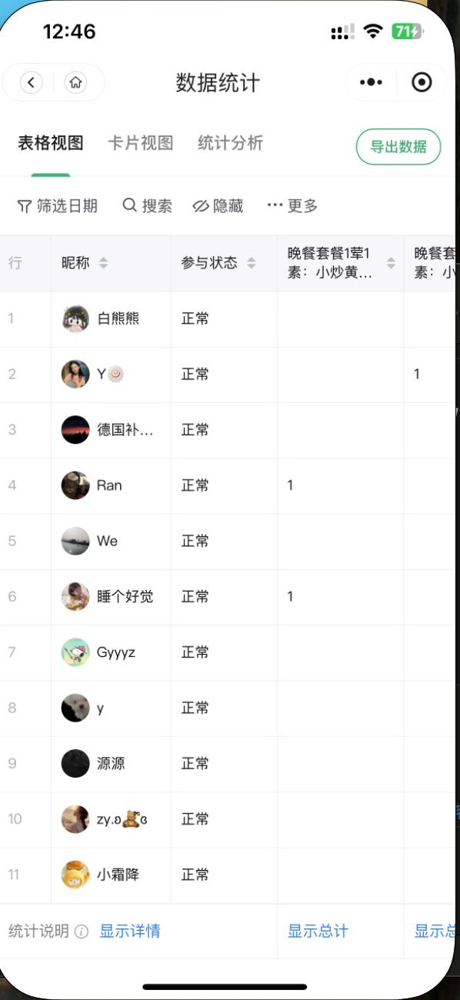

字段（按重要性排序）：
| 编号 | 顾客 | 金额 | 状态 | 菜品 | 配送点 | 时间 | 截图 | 备注 | 操作 |

- 可左右滑动看更多列
- 可点列头排序
- 可隐藏不需要的列
- 顶部可筛选：按状态、按配送点、按日期
- 顶部可搜索：按顾客名、电话、菜品

**卡片视图（参考群报数的卡片视图）：**

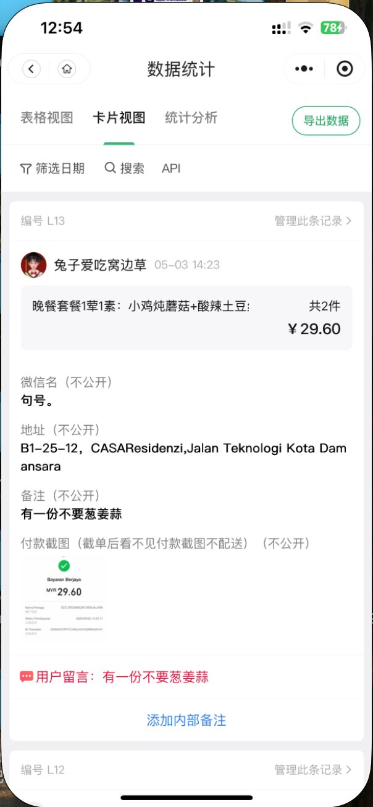

每个订单一张卡片，所有信息一次看完，适合手机查看。

**数据分析视图（参考群报数）：**

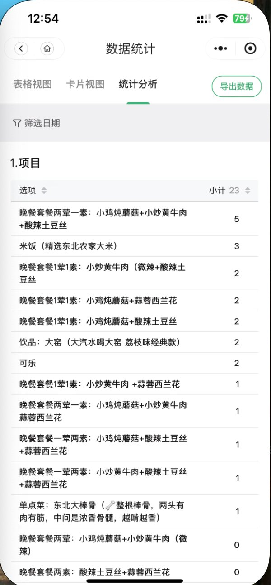

显示：
- 商品销量榜（双榜：真实销量 vs 提交热度）
- 收入趋势（按时段）
- 配送点分布

### 4.6.3 数据统计的关键改进

**和群报数最大的差异：所有数据按支付状态分组。**

```
晚餐套餐两荤一素
├── ✅ 已确认付款：3 份  RM 62.4  ← 真实销量
├── ⏳ 待确认：    1 份  RM 20.8
└── ❌ 待付款：    1 份  RM 20.8
─────────────────────────────────
合计提交：5 份         RM 104.0
有效销量：3 份         RM 62.4
```

**双榜显示：**

| 真实销量榜（按已付款）| 热度榜（按提交）|
|---|---|
| 1. 两荤一素套餐 3 份 | 1. 两荤一素套餐 5 份 |
| 2. 一荤一素套餐 2 份 | 2. 米饭 3 份 |

商户可以看出：哪些菜"看着想买但最终没买"。

### 4.6.4 待确认页（核心操作页）

最常用的操作页面，商户每天处理订单的主战场。

参考截图（订单详情）：

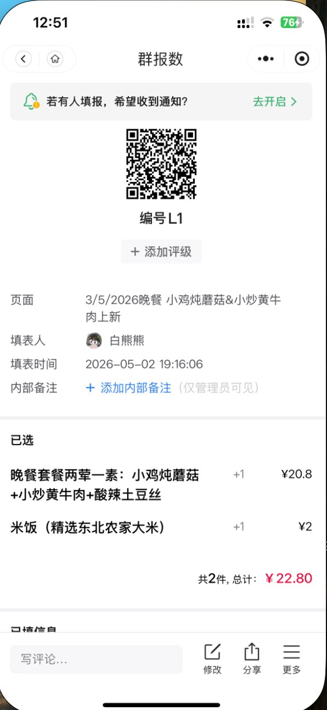

```
待确认订单（2）
─────────────────────────────
🟡 #L8  李美玲  RM 22.8  10:52 上传
   📷 [缩略图]  ← 上传时间早于下单
   1荤1素 ×1, 米饭 ×1
   [✓ 确认收款] [✗ 拒绝]
─────────────────────────────
🔴 #L9  王小红  RM 29.6  11:43 上传
   📷 [缩略图]  ← MD5 与历史截图重复
   2荤1素 ×1, 可乐 ×1
   [✓ 确认收款] [✗ 拒绝]
```

**点击截图缩略图：**

弹出全屏弹窗，同屏显示：
- 付款截图（可放大、可滑动）
- 订单明细（菜品、金额）
- 顾客信息
- 颜色提示原因（"⚠️ 截图上传时间早于下单时间"）
- [✓ 确认收款] [✗ 拒绝] 按钮

**确认后：** 订单移至"已确认"，状态实时更新

**拒绝后：** 弹出选择框
- 截图模糊
- 金额不符
- 截图无效
- 其他（自定义文字）
- 顾客收到通知，引导重新上传

### 4.6.5 三色提示系统

| 颜色 | 含义 | 触发条件 |
|---|---|---|
| 🟢 绿色 | 正常 | 截图上传时间正常，MD5 无重复 |
| 🟡 黄色 | 请注意 | 截图上传时间早于下单时间 |
| 🔴 红色 | 系统存疑 | MD5 与历史截图重复 |

**重要：三色都是辅助提示，不自动拒绝任何订单，最终由商户人工判断。**

### 4.6.6 订单详情页

```
┌─────────────────────────────┐
│ 订单 #L8                    │
│ [大字编号]                   │
├─────────────────────────────┤
│ 项目：3/5/2026 晚餐         │
│ 顾客：李美玲                 │
│ 下单时间：05-02 10:50       │
│ 配送点：配送点 2 · B 座入口  │
├─────────────────────────────┤
│ 📝 管理员备注（仅管理员可见）│
│ "VIP 老客户，多送米饭"       │
│ [+ 添加/编辑备注]            │
├─────────────────────────────┤
│ 已选商品                     │
│ 1荤1素 ×2          RM 29.6 │
│ ─────────                    │
│ 总计 RM 29.6                │
├─────────────────────────────┤
│ 顾客信息                     │
│ 姓名：李美玲                │
│ 电话：6012-3456789          │
│ 地址：B1-25-12, CASA...     │
│ 备注：（无）                │
├─────────────────────────────┤
│ 付款截图                     │
│ 🧾 截图 1  10:52  ✓已确认  │
│ [缩略图]                     │
├─────────────────────────────┤
│ 状态历史                     │
│ 10:50  顾客提交订单          │
│ 10:52  顾客上传截图          │
│ 10:55  管理员小李 确认收款    │
└─────────────────────────────┘

底部按钮：
[✏️ 修改订单] [🗑 取消订单] [📤 转出餐单]
```

**特色功能：**

1. **管理员备注（仅管理员可见）**
   - 商户/管理员可在订单上记录内部信息
   - 顾客看不到
   - 例："这个顾客上次没付款"、"VIP 老客户"

2. **状态历史**
   - 显示订单从下单到完成的所有时间节点
   - 包括是哪个管理员操作的（用于多管理员场景追溯）

---

## 4.7 出餐清单

按配送点分组显示，方便配送：

```
出餐清单 · 5/4 晚餐
─────────────────────────────
配送点 1 · A 座大堂（5 单）
─────────
#1  张三   1荤1素           RM 14.8  ✓
#4  白熊熊 2荤1素 + 米饭     RM 22.8  ✓
#7  睡好觉 1荤1素           RM 14.8  待付
─────────────────────────────
配送点 2 · B 座入口（3 单）
─────────
#2  李美玲 2荤1素 + 可乐     RM 22.8  ✓
...
─────────────────────────────
其他 · 按地址配送（2 单）
─────────
#6  陈刚 Taman Kepong 12 号  RM 20.8
   2 荤 1 素
─────────────────────────────

[📷 截图保存] [📤 复制文字]
```

可以截图发给送餐员。

---

## 4.8 手动匹配配送点

以下订单进入此队列：
- 顾客选了"以上都不对（其他）"
- 系统自动匹配失败（第二版才有）
- 顾客没确认匹配结果

```
待匹配订单（3）
─────────────────────────────
#2  李美玲  "A 那边 12 楼"
   选了：以上都不对
   [配送点 1] [配送点 2] [配送点 3]

#5  Raj    "blok a"
   选了：以上都不对
   [配送点 1] [配送点 2] [配送点 3]

#7  睡好觉  （未填地址）
   未匹配
   [配送点 1] [配送点 2] [配送点 3]
```

管理员点对应配送点，一键完成分配。

---

## 4.9 对账单

### 4.9.1 顶部汇总（组口径）

```
对账单 · 5/4 晚餐
─────────────────────────────
💰 已确认到账（组口径）：    RM 215.4 (11 单)
⏳ 待确认金额（组口径）：    RM 38.4  (2 单)
❌ 待付款（组口径）：        RM 19.6  (1 单)
─────────────────────────────
订单总额（未取消）：        RM 273.4 (14 单)
声称已付：                  RM 253.8 (13 单)
有效订单率：                78.5%（订单状态「已确认」/ 未取消单数）
```

当前实现说明（已落地）：

- **组口径**：金额按「付款组」累加，组边界只由**支付动作**决定（不是“首单/加购”标签）；与订单详情页分组、可确认逻辑一致。
- 三张卡片上的 **「单」**：指在当前「项目 + 凭证时间」筛选下，**至少含一档该状态组**的订单笔数；同一订单可同时计入多类（例如同订单既有已确认组，也有待确认组）。
- **待付款组**：包含尚未付清/未传加购凭证等落在「待付款」桶内的组金额（与 `partial_paid` 等状态兼容）。
- **全口径核对**：`已确认 + 待确认 + 待付款`（组金额之和）与 **订单总额（未取消）** 的差值一并展示，便于发现数据异常。
- **有效订单率**：仍为 **订单状态** 维度（`status === confirmed` 的订单数 / 未取消订单数），与组口径卡片区分。

### 4.9.2 清单与筛选

表格列（顺序）：**配送点**、时间、付款方、订单号、内容、**清单金额**、订单状态、凭证。

- **配送点**：首列；无配送点快照或名称为空时统一显示 **「未指定配送点」**；表格按配送点分段标题行，同一配送点集中展示。
- **清单包含**：可勾选 **已确认组 / 待确认组 / 待付款组**（可多选，至少保留一类）。仅统计、导出当前勾选范围内的组。
- **清单金额**：等于当前勾选桶内各组金额之和；**不一定等于订单全款**（与订单管理「同一单可出现在多标签」一致）。
- **商品展示**：可切换 **仅首行** / **全部行**（仅影响列表密度）；**导出 CSV 始终带当前勾选范围内的完整商品明细**（多行合并为「；」分隔）。
- **凭证时间**：在「筛选项目」下，凭证时间起止（精确到分钟）；命中规则为 `paymentScreenshots[].uploadedAt` 落在区间内，且条目含 **顾客上传 URL** 或 **免提交标记**。说明：若要表示「5 月 4 日 24:00」，请填 **次日 00:00**。
- **行交互**：点击一行进入订单详情，路径与订单管理一致：`/dashboard/:shopSlug/order/:projectId/:orderNumber`。
- **不再提供**对账单页的「一键确认待确认」；确认收款在订单详情中操作。

### 4.9.3 凭证列规则

- 满足以下任一条件时，清单显示文案 **「缺少凭证」**（与对账单业务口径一致）：存在 **免提交付款凭证**、订单状态为 **待付款（unpaid）**、或 **未足额付清**（`pendingAmount > 0`）。
- 否则不显示「有/无」文字，仅显示 **绿 / 黄 / 红** 圆点，取所有 **已上传截图** 条目中的 **最高风险旗标**；若条目标记了 `flag` 则直接使用；**顾客上传写入时若未带旗标，入库前会补齐为绿旗**（`withDefaultScreenshotFlagIfUrl`），与「未识别风险按绿」一致。

### 4.9.4 复制对账清单

「复制对账清单」生成文字版，按当前 **清单包含** 勾选，分 **已确认 / 待确认 / 待付款** 三节；每节内再按 **配送点** 分组列出订单及该节对应的组金额与商品摘要。

### 4.9.5 导出 CSV

- 按钮：**导出 CSV**（文件名含店铺 slug、项目 id、`清单包含` 勾选摘要，如 `已确认+待付款`）。
- 列：**配送点**、时间、顾客、电话、订单号、项目、**商品明细**（勾选桶内行）、**清单金额**、订单状态、凭证（`缺少凭证` 或 `绿旗/黄旗/红旗`）。

### 4.9.6 回归验收清单（发版前建议手测）

| 场景 | 预期 |
|------|------|
| 仅勾选「已确认组」 | 仅出现含已确认组的订单；清单金额仅含已确认组；导出一致 |
| 三桶全选 | 与改前可见范围一致（在相同项目/时间筛选下） |
| `partial_paid` + 多档加购 | 各支付动作形成的组落入正确桶；金额与详情页一致 |
| 无配送点订单 | 配送点列与分段均为「未指定配送点」 |
| 凭证时间窗边界 | 仅窗内上传/免提交时间的订单进入筛选 |
| 点击清单行 | 进入与订单管理相同的商户订单详情 |
| 顾客新上传截图 | Firestore 条目中 `flag` 为绿/黄/红之一（默认绿） |

自动化：`web` 目录执行 `npm run test` 覆盖 `reconciliationGroups` 与凭证 `flag` 默认值辅助函数。

---

## 4.10 店铺设置

```
店铺设置
─────────────────────────────
基本信息
├── 店名：[辉姐家常小厨]
├── 门头图片：[已上传] [更换] [删除]
├── Logo：[已上传] [更换]
├── 主题颜色：[●辣椒红] [○珊瑚橙] ... (8 种)
└── 营业说明：[今日休息]

付款方式
├── 付款码 1：TNG  [图片]
├── 付款码 2：DuitNow [图片]
└── [+ 添加付款方式]

配送点库 → 进入配送点管理

管理员 → 进入管理员管理
```

### 4.10.1 8 种主题色

辣椒红、珊瑚橙、青翠绿、靛蓝、玫瑰红、深棕、墨绿、暗紫

商户选一种，整个店铺的主色调（按钮、状态条等）跟随。

---

## 4.11 管理员管理

参考截图：

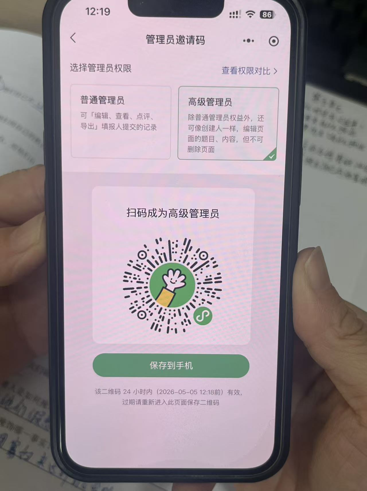


```
管理员（共 3 人，最多 20 人）
─────────────────────────────
辉姐家常小厨   [创建人]      你
We             [高级管理员]    [⋯]
陌小仙         [普通管理员]    [⋯]

[+ 添加管理员]
```

### 4.11.1 添加管理员

```
1. 点 [+ 添加管理员]
2. 选权限级别：
   ○ 普通管理员（只能管订单）
   ● 高级管理员（与创建人同级，限制几项）
3. 系统生成专属邀请链接
   yourapp.com/invite/AbC123XyZ
   [复制链接] [生成二维码]
4. 链接 24 小时有效
5. 复制后发给对方（微信/WhatsApp）
```

### 4.11.2 管理员操作菜单（[⋯]）

```
- 设置为普通管理员
- 设置为高级管理员
- 删除该管理员
- 转让创建人（第二版）
```

---

## 4.12 历史记录与统计

### 4.12.1 历史项目列表

按文件夹分组，列表显示。点击进入查看历史订单和对账单。

### 4.12.2 跨项目统计（第二版）

显示一段时间内的整体经营数据：
- 月度收入
- 月度订单数
- 复购率
- 热卖商品

---

## 4.13 分享卡片生成

### 4.13.1 第一版只做一张：菜品推广卡

参考截图（群报数的分享卡，但去掉群报数 Logo）：

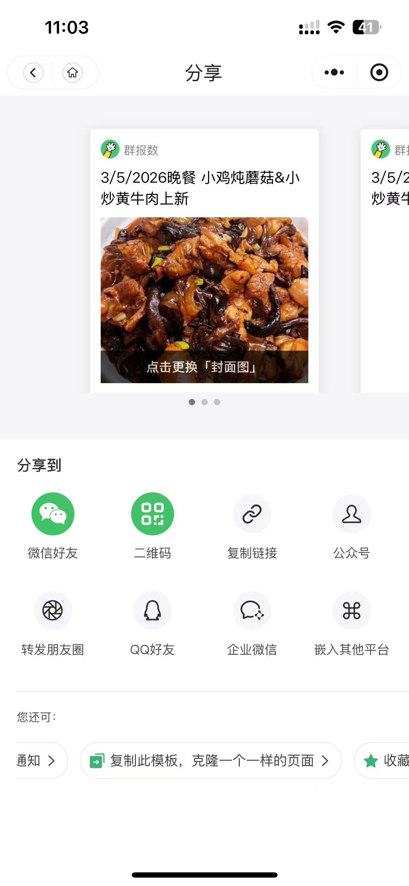

```
┌─────────────────────────────┐
│  店名 + Logo                 │
│  [图文区第一张图作为封面]      │
│  项目名称（大字）             │
│  截止时间 · 已报人数           │
│  [链接二维码]  扫码报名         │
└─────────────────────────────┘
```

### 4.13.2 规格

| 项目 | 规格 |
|---|---|
| 卡片尺寸 | 1080 × 1440px（3:4 竖版）|
| 主题色 | 跟随商户主题 |
| 店名 | 加粗显眼 |
| **平台 Logo** | **不显示** |
| 二维码 | 当前项目 H5 链接 |
| 数据 | 实时报名人数 |

### 4.13.3 操作

```
[📤 生成分享卡片]
   ↓
预览卡片
[💾 保存到相册]  [🔄 重新生成]
```

### 4.13.4 实现方式

- 使用 html2canvas 或 Canvas API
- 前端渲染，无需后端

---

## 4.14 PWA 配置

商户后台支持 PWA：

### 4.14.1 manifest.json

```json
{
  "name": "辉姐家常小厨 · 商户后台",
  "short_name": "辉姐后台",
  "icons": [...],
  "start_url": "/dashboard/huijie",
  "display": "standalone",
  "theme_color": "#E63946"
}
```

### 4.14.2 推送通知

新订单/付款时推送：
- "🔔 新订单：李美玲 RM 22.8"
- "🔔 新付款上传：王小红 #L9"

iOS PWA 推送限制已知，第一版做出来即可，遇到问题再解决。

### 4.14.3 离线缓存

Service Worker 缓存：
- 静态资源（JS/CSS/图片）
- 已加载的订单数据
- 失去网络时仍可查看

---

## 4.15 意见反馈入口

```
商户后台右上角永久入口：[💬 反馈]

点击 → 反馈表单（同顾客端）
```
